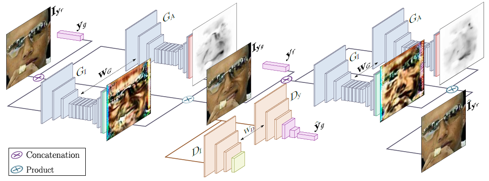

# GANimation_TL

A tensorlayer implementation of GANimation

paper: https://arxiv.org/abs/1807.09251

Author's implementation: https://github.com/albertpumarola/GANimation

Reference: https://github.com/hao-qiang/GANimation-tf

## Requirements
- tensorflow-gpu 1.6.0
- tensorlayer 1.11.0

## Architecture


## Result


## Data

Reference: https://github.com/hao-qiang/GANimation-tf

Use Action Units vectors for the [EmotionNet](https://cbcsl.ece.ohio-state.edu/EmotionNetChallenge/index.html) extracted using [OpenFace](https://github.com/TadasBaltrusaitis/OpenFace), or **preprocessed [CelebA](http://mmlab.ie.cuhk.edu.hk/projects/CelebA.html) dataset**

## Model

Re-implement model in TensorLayer

## Run
```
python main.py
```
